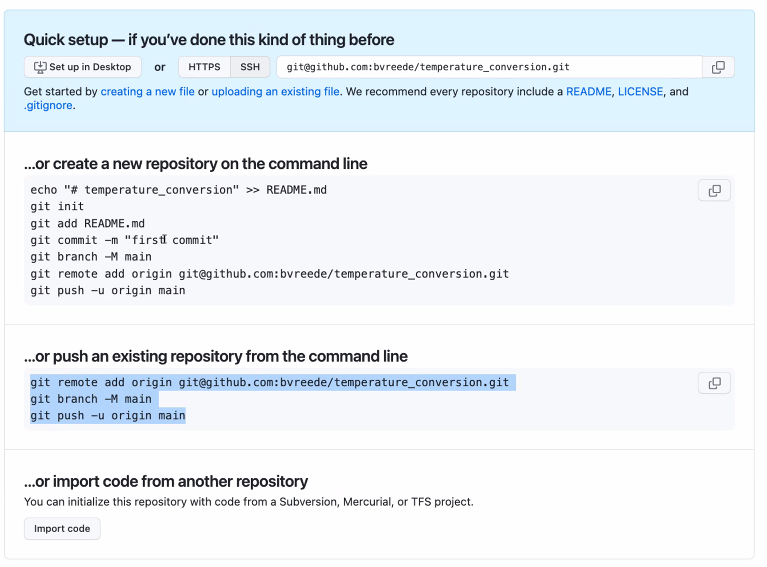

# Day 2 - 2023-06-19-ds-cr

Welcome to The Workshop Collaborative Document.

This Document is synchronized as you type, so that everyone viewing this page sees the same text. This allows you to collaborate seamlessly on documents.

[TOC]

----------------------------------------------------------------------------

## 👮Code of Conduct

Participants are expected to follow these guidelines:
* Use welcoming and inclusive language.
* Be respectful of different viewpoints and experiences.
* Gracefully accept constructive criticism.
* Focus on what is best for the community.
* Show courtesy and respect towards other community members.

## 🎓 Certificate of attendance

If you attend the full workshop you can request a certificate of attendance by emailing to training@esciencecenter.nl .

## ⚖️ License

All content is publicly available under the Creative Commons Attribution License: [creativecommons.org/licenses/by/4.0/](https://creativecommons.org/licenses/by/4.0/).

## 🙋Getting help

To ask a question, raise your hand in zoom. Click on the icon labeled "Reactions" in the toolbar on the bottom center of your screen,
then click the button 'Raise Hand ✋'. For urgent questions, just unmute and speak up!

You can also ask questions or type 'I need help' in the chat window and helpers will try to help you.
Please note it is not necessary to monitor the chat - the helpers will make sure that relevant questions are addressed in a plenary way.
(By the way, off-topic questions will still be answered in the chat)

## 🖥 Workshop website

[link](https://esciencecenter-digital-skills.github.io/2023-06-19-ds-cr/)

🛠 Setup-

[link](https://esciencecenter-digital-skills.github.io/2023-06-19-ds-cr#setup)

## 👩‍🏫👩‍💻🎓 Instructors

Barbara Vreede, Dani Bodor

## 🧑‍🙋 Helpers

Candace Makeda Moore, Ewan Cahen


## 🗓️ Agenda
| Time  | Topic                             |
|------:|:----------------------------------|
| 9:00  | Welcome and icebreaker            |
| 9:15  | Workshop Introduction             |
| 9:30  | Collaboration with Git and GitHub |
| 10:15 | Coffee break                      |
| 10:30 | Collaboration with Git and GitHub |
| 11:30 | Coffee break                      |
| 11:45 | Collaboration with Git and GitHub |
| 12:45 | Wrap-up                           |
| 13:00 | END                               |

## 🔧 Exercises

### Exercise: Working as a project collaborator (in breakout rooms)

Do this exercise in pairs; ideally you do this twice and have worked both as person A and as person B.

#### Part 1
- PERSON A: Create an issue in their repository
- PERSON B: Clone this repository to their system (note: you can also do this online, like Dani did)
- PERSON B: Create a new branch
- PERSON B: Make the changes requested in the issue
- PERSON B: Push the changes to the remote repository on GitHub
- PERSON B: submit a Pull Request, refer to the issue (e.g. "Closes #1")

#### Part 2
- PERSON A: review the Pull Request
- PERSON B: address the comments
- PERSON A: approve the Pull Request
- PERSON B: merge the Pull Request

### Exercise: Working as an external contributor (in breakout rooms)

#### Part 1
- PERSON A: Create an issue in Person B's repository
- PERSON A: Fork the repository to their own (= Person A's) account
- PERSON A: Clone the repository, make changes, push them back to the fork
- PERSON A: Submit a Pull Request from the fork to the original repository

#### Part 2
- PERSON B: Make a change in the original repository in the same place as person A's proposed changes
- PERSON A: Solve the merge conflict in the Pull Request
- PERSON B: Review/Approve the Pull Request
- PERSON B: merge the Pull Request

## 🧠 Collaborative Notes

### Programming vs Software Engineering

Software engineering is programming integrated over time.


### Setting up a repository

First, check your SSH access to GitHub:

```shell=
ssh git@github.com
```

It should say something like

```
Hi username! You've successfully authenticated, but GitHub does not provide shell access.
Connection to github.com closed
```

Move to whatever folder location you would like to create a dummy project and create a folder for it:
```shell=
mkdir temperature_conversion
cd temperature_conversion
```

Create a git repo in here:
```shell=
git init
```

Create a python file that we will use to convert temperatures

```shell=
touch conversion.py
```

add it to your repo:
```shell=
git add conversion.py
git commit -m "add first file"
```

open folder in any editor that you like to work in.
For example, if you use Visual Studio Code (VSCode), then from your top git folder type:
```shell=
code .
```

In your python file, create a function to convert celsius to fahrenheit:
```python=
def celsius_to_fahrenheit(celsius):
    fahrenheit = celsius/5*9 + 32
    return fahrenheit
```
save the file

### Create a new repository on github
1. Open a browser and navigate to github.com.
2. In the top right corner, click the "+" and then "New repository".
3. Give your repository a name (it is common practice to give it the same name as your folder, but this is not mandatory).
4. Make it Public, but **don't let GitHub automatically add anything else.**

### Populating the repository
GitHub will show you 3 options of how to populate the repository:


we will use the second option (push an existing repository from the command line). Use the ssh version of this. Copy the code from the code block and paste it into your shell

```shell=
git remote add origin git@github.com:<username>/temperature_conversion.git
git branch -M main
git push -u origin main
```

This connects your local repository to the repository on github.com

commit the changed conversion file:
```shell=
git add convesion.py
git commit -m "add conversion function"
git push
```

**Start if you're behind** If you're behind, clone the full existing repo:
```shell=
git clone git@github.com:bvreede/temperature_conversion.git
```

Follow the instructions above to create a repository on github.com

Add your repo as a remote:
```shell=
git remote set-url origin git@github.com:<username>/temperature_conversion.git
```

Check it with
```shell=
git remote -v
```

**End if you're behind**

### Collaborating on the repository

Do the following with your partner in a break out room:

On github.com, add a collaborator in the settings of your repository by adding your partners username.

Visit the issues tab. Issues are for discussing problems, bugs, potential new features etc. Issues can be raised by users of the software or the creators of the software.

Create an issue called `add function to convert to kelvin` and with text `Currently, the functionality only contains celsius -> fahrenheit. It would be nice to also have celsius -> Kelvin.`

Your partner will then see notifications on the top right (with a small blue circle). Your partner should click this button, open the invitation and accept it.

In the issue, on the right, under `Assignees`, you can now add yor partner.

Your partner will now, on the code tab, go to the file and edit it directly from their browser by clicking on the pen sign.

They will add the following code:
```python
def celsius_to_kelvin(celcius):
    return celsius + 273.15
```

They will then on the top right click on the top right on `Commit changes...`. Give it the commit message `add a function to convert celsius to kelvin`. In the same screen, select the option to create a new branch for this commit. Call the branch `celciustokelvin`.

Now it automatically will bring your partner to a screen to open a pull request. Write a useful message like `I created a function to convert celsius to kelvin`.

Also add the text `closes #1`. As soon as your partner entered the pound sign (`#`), your partner will get suggestions for auto completion.

Each issue and pull request has a unique  number, which you can refer to with the pound sign (`#`).

In the insights tab, you can see various pieces of information related to your repository.

You, the repo owner, should look at the pull request. On the `Files changed` tab, you can see the differences that this pull request wants to add. Review the changes and make a suggestion by adding a new line in the code. Click on `Start a review`. Now click on `Finish your review`, write a message (like that it would be nice to add a new line at the end) and approve it.

**Note:** Approving a pull request does *not* merge it yet. In some repositories, an approval is requires before a pull request can me merged, in some this is not required. In both cases, the review process is a form of communication between the repository owners and the people who contributed to the pull request.

**Note:** In practice, it is not a good idea to make changes to code on the GitHub website directly. Instead, you should make changes locally so you will be able to try out and test your code first before you make a pull request.

Your partner can now see in their notifications that you reviewed the pull request. They can now easily accept  code request you made. They should now merge the pull request. In the history of the code, you can now see that the branch is merged. It is now also possible to delete the merged branch.

In the `Insights` tab, in the `Newtork` section, you can also see the history. In the `Issues` tab you can see that there are no open issues anymore and that there is one closed issue.


### Collaborating on a repository you don't have write access to

When you want to edit a file in a repository you don't have write access to, you will be suggested to make a *fork*, which is a version of the repository on your account with a link to the original repository.

A *clone* makes a *local* repository from a remote repository. A *fork* makes a *remote* repository from a remote repository, keeping a connection between the two.

A fork is meant so you can propose changes to a repository you don't have write access to.

Your fork won't be automatically updated with changes from the original repo. You can click the sync button to do this on github.com.

After you made a fork, clone it to your computer. Add the following code:

```python=
def kelvin_to_fahrenheit(kelvin):
    celcius = kelvin - 273.15
    return celcius_to_fahrenheit(celcius)
```

When on a fork, you don't necessarily need to make a branch, but it might sill be helpful to do so in organising your code.

Make a new branch commit with
```shell=
git checkout -b kelvinfahr
git add conversion.py
git commit -m "add functionality kelvin to fahrenheit"
```

Push it with
```shell=
git push -u origin kelvinfahr
```

Go to the *original* repository on github.com and create a new pull request. Click on `compare accross forks`. The base branch should be `main` and the `head` should be your repository and the branch `kelvinfahr`.

Now add a message to your pull request and create it.

## 📚 Resources

- How to make code suggestions in pull request reviews: https://docs.github.com/en/pull-requests/collaborating-with-pull-requests/reviewing-changes-in-pull-requests/commenting-on-a-pull-request
- GitIgnore exclamation mark discussion: https://stackoverflow.com/questions/65776556/exclamation-mark-in-gitignore-doesnt-work

