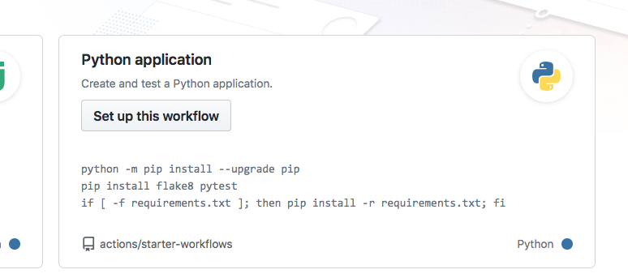
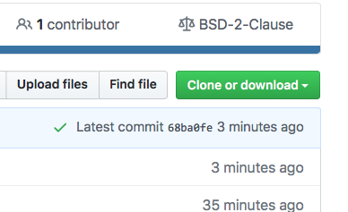

# Day 4 - 2023-06-19-ds-cr

Welcome to The Workshop Collaborative Document.

This Document is synchronized as you type, so that everyone viewing this page sees the same text. This allows you to collaborate seamlessly on documents.

[TOC]


## 👮Code of Conduct

Participants are expected to follow these guidelines:
* Use welcoming and inclusive language.
* Be respectful of different viewpoints and experiences.
* Gracefully accept constructive criticism.
* Focus on what is best for the community.
* Show courtesy and respect towards other community members.

## 🎓 Certificate of attendance

If you attend the full workshop you can request a certificate of attendance by emailing to training@esciencecenter.nl .

## ⚖️ License

All content is publicly available under the Creative Commons Attribution License: [creativecommons.org/licenses/by/4.0/](https://creativecommons.org/licenses/by/4.0/).

## 🙋Getting help

To ask a question, raise your hand in zoom. Click on the icon labeled "Reactions" in the toolbar on the bottom center of your screen,
then click the button 'Raise Hand ✋'. For urgent questions, just unmute and speak up!

You can also ask questions or type 'I need help' in the chat window and helpers will try to help you.
Please note it is not necessary to monitor the chat - the helpers will make sure that relevant questions are addressed in a plenary way.
(By the way, off-topic questions will still be answered in the chat)

## 🖥 Workshop website

[link](https://esciencecenter-digital-skills.github.io/2023-06-19-ds-cr/)

🛠 Setup

[link](https://esciencecenter-digital-skills.github.io/2023-06-19-ds-cr#setup)

## 👩‍🏫👩‍💻🎓 Instructors

Barbara Vreede, Dani Bodor

## 🧑‍🙋 Helpers

Candace Makeda Moore, Ewan Cahen

## 🗓️ Agenda
|  Time | Topic                                  |
| -----:|:-------------------------------------- |
|  9:00 | Welcome and icebreaker                 |
|  9:15 | Introduction to testing                |
| 10:15 | Coffee break                           |
| 10:30 | Introduction to Continuous Integration |
| 11:30 | Coffee break                           |
| 11:45 | More advanced testing                  |
| 12:45 | Wrap-up                                |
| 13:00 | END                                    |


## 🔧 Exercises

### Exercise 1: Write tests

1. For your existing function, write a test.
2. Ensure the test definition starts with `test_` (e.g. `def test_celsius_to_fahrenheit()`)
3. Add at least 3 different `assert` statements to your test.
4. Run the test in the console/terminal using `pytest`.

#### Solutions/Answers:

```python
from conversion import celsius_to_fahrenheit

def test_celsius_to_fahrenheit():

    fahrenheit = celsius_to_fahrenheit(20)
    assert fahrenheit == 68

    fahrenheit = celsius_to_fahrenheit(0)
    assert fahrenheit == 32

    fahrenheit = celsius_to_fahrenheit(100)
    assert fahrenheit == 212
```

```python
from conversion import celsius_to_fahrenheit
from conversion import celsius_to_kelvin

def test_celsius_to_fahrenheit():
    assert celsius_to_fahrenheit(20) == 68

def test_celsius_to_kelvin():
    assert celsius_to_kelvin(20) == 293.15
    assert celsius_to_kelvin(0) == 273.15
```
```python
from conversion import celsius_to_fahrenheit
def test_celsius_to_fahrenheit():
     assert celsius_to_fahrenheit(10)==54.5
```

```python
from conversion import check_unit_validity
def test_check_unit_validity():
    assert check_unit_validity("C") is True
    assert check_unit_validity("F") is True
    assert check_unit_validity("K") is True
    assert check_unit_validity("X") is False
```

```python
from conversion import kelvin_to_fahrenheit
import pytest

def test_kelvin_to_fahrenheit():
    tiny_kelvin = 1e06
    assert kelvin_to_fahrenheit(40) == pytest.approx(387.67,tiny_kelvin)
```

```python
from conversion import celsius_to_fahrenheit

def test_celsius_to_fahrenheit():
        assert celsius_to_fahrenheit(20) == 68
        assert isinstance(celsius_to_fahrenheit(-1000), str)

```

#### Exercise 2:
Push tests and workflow to your main branch, check that everying runs (please add a green checkmark online once working, or red if problems). You send a link if you have questions on your specific repo. Final situation: on your main branch a github actions workflow and tests functioning.


#### Full cycle /Final summary exercise:

### Exercise: Full-cycle collaborative workflow
This is an expanded version of the automated testing demonstration. The exercise is performed in a collaborative circle within the exercise group (breakout room).

The exercise takes 30-40 minutes.

In this exercise, everybody will:

A. Set up automated tests with GitHub Actions
B. Make test fail / find a bug in their repository
C. Open an issue in their repository
D. Then each one will clone the repo of one of their exercise partners, fix the bug, and open a pull request (GitHub)
E. Everybody then merges their co-worker’s change


#### Step 1: Create a new repository on GitHub

- Select a different repository name than your colleagues (otherwise forking the same name will be strange)
- Before you create the repository, select “Initialize this repository with a README” (otherwise you try to clone an empty repo).
- Share the repository URL with your exercise group via shared document or chat

#### Step 2: Clone your own repository, add code, commit, and push

Clone the repository.

Add a file `example.py` containing:

```python=
def add(a, b):
    return a + b

def subtract(a, b):
    return a + b  # do not change this line until prompted to do so.
```

Write a test function `def test_add()` for `add` to check that this function is working properly. Do NOT add a test function for `subtract` (yet).
Run pytest to ensure it works

Then stage the file (`git add <filename>`), commit (`git commit -m "some commit message"`),
and push the changes (`git push`).


#### Step 3: Enable automated testing

In this step we will enable GitHub Actions.
- Select "Actions" from your GitHub repository page. You get to a page "Get started with GitHub Actions".
- Select the button for "Set up this workflow" under Python Application.


Select “Python application” as the starter workflow.

GitHub creates the following file for you in the subfolder `.github/workflows`:


   ```yaml
# This workflow will install Python dependencies, run tests and lint with a single version of Python
# For more information see: https://help.github.com/actions/language-and-framework-guides/using-python-with-github-actions

name: Python application

on:
  push:
    branches: [ main ]
  pull_request:
    branches: [ main ]

jobs:
  build:

    runs-on: ubuntu-latest

    steps:
    - uses: actions/checkout@v2
    - name: Set up Python 3.9
      uses: actions/setup-python@v2
      with:
        python-version: 3.9
    - name: Install dependencies
      run: |
        python -m pip install --upgrade pip
        pip install flake8 pytest
        if [ -f requirements.txt ]; then pip install -r requirements.txt; fi
    - name: Lint with flake8
      run: |
        # stop the build if there are Python syntax errors or undefined names
        flake8 . --count --select=E9,F63,F7,F82 --show-source --statistics
        # exit-zero treats all errors as warnings. The GitHub editor is 127 chars wide
        flake8 . --count --exit-zero --max-complexity=10 --max-line-length=127 --statistics
    - name: Test with pytest
      run: |
        pytest
   ```


#### Step 4: Verify that tests have been automatically run

Observe in the repository how the test succeeds. While the test is executing, the repository has a yellow marker.
This is replaced with a green check mark, once the test succeeds.



Green check means passed.

Also browse the "Actions" tab and look at the steps there and their output.

#### Step 5: Add a test which reveals a problem

After you committed the workflow file, your GitHub repository will be ahead of your local cloned repository. Update your local cloned repository:

```
$ git pull origin main
```

Next uncomment add a test function `test_subtract` for to check that the `subtract` function can subtract two numbers from each other, and push it to your remote repository.
Verify that the test suite now fails on the “Actions” tab (GitHub).


#### Step 6: Open an issue on GitHub
Open a new issue in your repository about the broken test (click the “Issues” button on GitHub and write a title for the issue). The plan is that your colleague will fix the issue through a pull request

#### Step 7: Fork and clone the repository of your colleague

Fork the repository using the GitHub web interface.
Make sure you clone the fork after you have forked it. Do not clone your colleague’s repository directly.


#### Step 8: Fix the broken test

Fix the function now and run pytest to check that it works.
Then push to _your fork_. Check whether the action now also passes.
(Note from Barbara: the Actions do not always run in this step. We don't know why — but you can move on with the next step, because the Actions will be triggered by a pull request in the original repository.)

#### Step 9: Open a pull request (GitHub)

Then before accepting the pull request from your colleague, observe how GitHub Actions automatically tested the code.

If you forgot to reference the issue number in the commit message, you can still add it to the pull request: `my pull request title, closes #NUMBEROFTHEISSUE`

#### Step 10

Observe how accepting the pull request automatically closes the issue (provided the commit message or the pull request contained the correct issue number).

Discuss whether this is a useful feature. And if it is, why do you think is it useful?


## 🧠 Collaborative Notes
For those setting up the GitHub Pages for their documentation:

- Make sure all your documentation code is merged to `main` (you can do this with a pull request from the `Documentation` branch).
- Check in the Actions tab whether the workflow has completed. Your workflow should now have created a new branch `gh-pages`.
- Go into your repository's Settings
- Click 'Pages' (on the left side menu)
- Under "Source" select "Deploy from branch"
- Under "Branch" select "gh-pages", and make sure to select `/root`
- Save, and check the Actions tab for progress on the deployment of your documentation.

An example repository can be found here: https://github.com/DaniBodor/temperature_conversion


Welcome to day 4. We begin with Q and A on yesterday:
#### Questions:
1. Errors in sphinx, extension versus extensions in code: why does it make a difference? A: in the documents there is a wrong letter, and it interferes with Sphinx. Look a the example repository (working example) and yours side by side for trouble shooting.

2. With large projects, they grow to many files. How to create documentation that gives a good overall overview of everything that is in all the code? A: This is an issue of what goes where (README, incode comment, documentation). A. Depends, it can be done in various places, and can be duplicated, on README, on a added wiki and other places. In terms of developers looking for functions git grep, and IDE search functions. Possible use for doxygen?
3. Actions on Github, which actions to use? A. Listed above in collaborative notes are final steps after you have locally working documentation
4. Why do this through Github? A. Automatic updates

Showing github pages:
1. go to github.com repository (own tem conversion repository)
2. Go into settings, on left find Pages bar.(click)
3. Source- Deploy from a branch, click, gh-pages branch
4. Deploy from the root, because the branch was populated with output from Spinx to there, then click save
5. On actions you should see workflow running
6. Your url will show in actions, but also on the pages page, and also the pattern is standard (you can figure it out from the pattern- username.github.io/name_of_repo)
7. Use Dani's url as an example of functioning documentation

Note there can be delays due to caching and other technical issues before you see github update.
Git/Github are very useful because they allow a stable functioning state of your project, while having a functioning version (the main branch). The main branch should be always functional, as a strong best practice. Note there is a functionality to protect main branch, then the only way you can change main is with a review, or whatever parameters you set as checks.

#### Testing:

Note: slides are in bvreede repository and also on github pages (as an instance)

In the exercise yesterday we worked with a function, and the goal was to keep functionality unchanged while improving the code. How was this done?
Awnsers: checking output, prepared some test cases, for every change running tests; comparing outputs to old outputs

Running something with an expected output is a test. Today we cover this as a saved process. It does not have to be done manually. You build up test cases, and then every time you run you can check these, automatically.

Why test? Preserve functionality, find errors early, facilitate reproduciblity, help users verify that things are working, help developers (make refactoring easier, simplify external contributions). Tests help manage complexity.

There are different types of tests. Can be divided into unit tests and integration tests. A unit test has no dependencies of outside code. Integration tests test whether units work well together, or entire workflows.

How much testing is enough testing? Various methods and metrics. Maybe you should have 3 lines of code in tests per line of code? Another metric is coverage. Example shown on coverage with sonarcloud.io. There are several tools available to check the coverage. Sonarcloud can show you covered versus uncovered code, and there are many tools that will do this. Note coverage does not mean the code is functional or properly tested.

Pytest is a recommended Python testing framework. Use docs.pytest.org (https://docs.pytest.org/en/7.3.x/) to see documentation.

From terminal: (optional code along)

1. go to test branch`git switch -c add_tests`
2. create a test file `touch test_conversion.py`
3. `code .` should open visual studio code if you want to work there on file
4. In new file (test_conversion.py) we will write a test for conversion.py. `from conversion import celcius_to_farenheit` will access file.
5. Write a test start test with name of test, should start with `test`, note convention of having name of test:
6. Write test
```python=
def test_celsius_to_farenheit():
        assert celsius_to_farenheit(20) == 68

```

7. make sure you activate conda with coderefinery environement
8. run `pytest`
9. examine output


Talking throught exercise and issues:
Q: If we run pytest will it run all the test_ files? A. Yes. You can also run pytest on a specific file or even just one function on that file i.e. `pytest name_of_file -k name_of_function`

Q. Can we test when we don't have an exact (like an integer) number but rather a float/recurring decimal how do we handle it? For example, an you code to a margin of error? A. You can round off results, you can assert that absolute difference is less than a certain range and other different ways depending on your goal for testing. There are also a functions that asserts approximate equality e.g. pytest.approx.


Q. Collecting items? What is it collecting? A. collecting number of functions. Note that each function can only fail one, even with multiple assert statements (with even one assert failing).

Looking at unexpected things in tests:

```python=
def test_celsius_to_farenheit_invalid():
    with pytest.raises(TypeError):
        celsius_to_farenheit("Invalid")
    # we will write the test to pass with particular error messafe

```
You can test for specific error messages. You can also test what happens when you get a none

```python=

def test_celsius_to_farenheit_none():
    assert celsius_to_farenheit(None) is None

```

You can write 'the other way around'. You can write a test you want to pass, then writing the code. This is called test driven development. This is a useful way of programming. One benefit of test driven development is that you know your tests can fail.

In this case we added code to our conversion.py file (approximately like the below):

```python=
if celsius is None:
    return None
```

That was test driven development (TDD).

Note tests can pass for undesired reasons i.e. you forgot to assert anything (example below)

```python=
def test_that_doesnt_do_anything():
    celcius_to_farenheit(0)
```
Extra benefit of TDD is that coverage kept really high.


Running tests automatically on Github repository (Code along example):

`$ git add test_conversion.py`
`$ git add conversion.py`
`$ git commit -m "add more functionality to conversion"`
`$ git push` or with -u flag to branch


Add a worflow on Github. Click configure on Python application, and you will get a premade yaml file, save and commit it onto main (can be done from ghub interface). Specifically: Actions tab, new workflow, then use premade yaml.

Now we set up github actions with a workflow that runs on pushes and pull requests.

The action will initially fail because there are no tests on the `main` branch yet, that's OK.

Optional code-click along:

Doing a pull request to main (click create pull request button)
Watch as workflow runs inside pull request (PR)
You can check actions, and the commits, checks, and files changed will display
We can examine the action in depth, and see what passes, and what "complains".
We can merge the pull request seeing that all our checks have passed.


Note: You can check that workflow is present if you go to your actions tab,  you should have Python application as a workflow. You can alter when the workflow runs from inside yaml file. Our current yaml will run on a pull request.


Q. When you keep merging on your Github, your local main can get behind. What is best practice? A. On your local machine `git pull` your changes.

Final points on testing:
pytest collects and run everything that starts with test_
and a test can pass when it didn't have an assertion
If you work with pure functions, i.e. no side effects, have referntial transparency i.e. replacing a call with returnon function should not change anything -> then they are easy to understand and easy to test.

Not all impure functions are intuitive e.g.
If you append to a list it is intuitively impure. But sometimes something like a simple print statement can make a function impure, also there are other ways a function can be impure, but it is hard to notice.
Side effects are not inherently bad. Sometimes side effects and an impure function is neccesary. Some side effects are hard to spot; but you can with creativity test impure functions.
Use pure functions when possible, testing doesn't have to be hard, there are metrics to look at test coveragre. Balance unit and integration tests. Testing helps a lot with refactoring.

#### Final notes:

We have covered many thigns this week including  version control. Please keep it up on version control and Git. Practice with small repositories that are not that crucial. We also saw documentation. The main take-away is that documentation is useful, and it can be automated in terms of extraction from the code. Documentation depends on the project and users. We covered writing tests, and automating tests on a Github repository.

For many things is takes time to set up. Even for short projects, but these things pay off. Doing these things will return the time that you spend on it.
The escienc center provides more training: https://www.esciencecenter.nl/digital-skills/
We encourage you to sign up to our newsletter, and consider future trainings.

Collaborative documents will be archived without personal information (stripped out before archiving). You will get a link to the archived versions by email.

All of our public training materials are open-source and available online. The lesson materials may be from carpentries, code-refinery or in-house from NleSC.


## 📚 Resources

- Explanation of linting: https://www.freecodecamp.org/news/what-is-linting-and-how-can-it-save-you-time/
- Python linters (popular ones on list): https://realpython.com/python-code-quality/
- Pytest documentation: https://docs.pytest.org/
- List of eScience Center workshops: https://www.esciencecenter.nl/digital-skills/